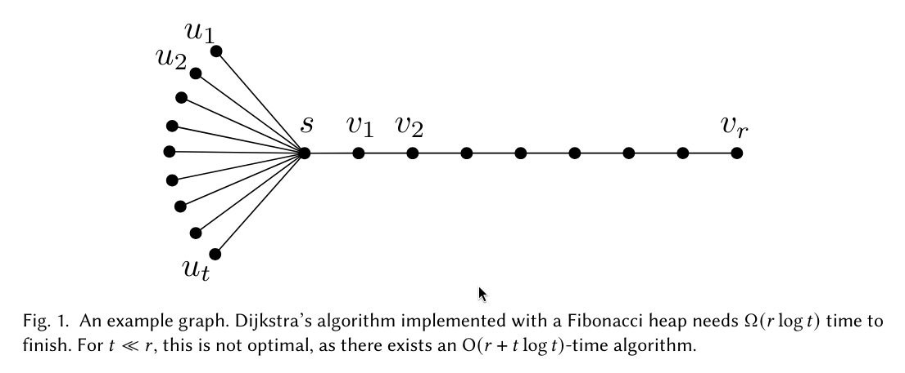

# An Implementation of "Universal Optimality of Dijkstra via Beyond-Worst-Case Heaps" 

[Paper Link](https://arxiv.org/abs/2311.11793)

This repository implements Dijkstra algorithm using:
 1. Binary Heap
 2. Fibonacci Heap
 3. Working-Set Bound Heap (As described in the paper)

## Benchmarks

Benchmarks are ran on the following graph
(with variable `t` and `r` values).

TODO

